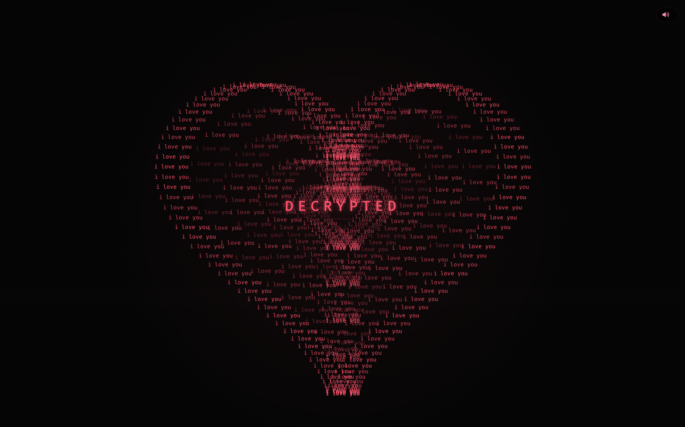

# You My Heart
Интерактивная веб-история на React
Сценарий с Canvas-анимациями, музыкальным сопровождением, фотогалереей, лайтбоксом и полной адаптацией для мобильных экранов.


## 🚀 Демо

**[Открыть живую версию](https://gift-chi-five.vercel.app/)**



## О проекте
You My Heart — это многоэтапное интерактивное веб-приложение, реализующее сценарий «расшифровки послания»: от терминальной загрузки и анимации появления сердца до галереи фотографий в стиле полароид и финальной открытки.

Проект создан для демонстрации навыков работы с:

- React 19 — компонентный подход, хуки, управление состоянием, refs;

- Canvas API — сложные 2D-анимации, оптимизация производительности, учёт devicePixelRatio;

- CSS-анимациями и адаптивной вёрсткой — media queries, поддержка hover/touch, retina;

- Web API — Web Share API, Fullscreen API, DeviceOrientation API, Clipboard API;

- Аудио — управление несколькими аудиодорожками, громкость, переключение треков.

## 🧠 Типизация данных

Хотя проект написан на JavaScript (JSX), все ключевые структуры данных описаны в `src/types.ts` с помощью TypeScript-интерфейсов. Это даёт:

- надёжное автодополнение и проверку во время разработки;
- единый контракт для пропсов компонентов;
- лёгкий переход на TypeScript в будущем.

Пример из `types.ts`:

```ts
export interface Photo {
  src: string;
  text: string;
}

export interface StorySlide {
  title: string;
  text: string;
}
```

## Ключевые возможности
### 🧩 Поэтапный сценарий (state machine)
Приложение проходит через чётко определённые этапы:

preload → console → memory → reveal → slides → final → photos → end

Каждый этап — отдельный экран со своей логикой и анимациями. Переходы контролируются состоянием stage, что делает сценарий гибким и легко расширяемым.

### 🎨 Canvas-анимации
Сердце из надписей
Параметрическая кривая сердца, состоящая из множества точек с текстом i love you. Точки появляются с задержкой, создавая эффект «рисования»; после полного появления добавляется пульсация.

Галактический фон
Движущиеся звёзды с параллаксом и разной скоростью, ограничение FPS для плавности.

Падающие сердечки
Пул объектов, спавн, движение по синусоиде, изменение прозрачности, очистка за пределами экрана.

Все анимации используют requestAnimationFrame и корректно обрабатывают visibilitychange для экономии ресурсов.

### 🎵 Музыкальная панель
Два аудиоэлемента, переключение треков по кругу;

Плавная регулировка громкости, mute/unmute;

Автовоспроизведение только после первого взаимодействия (политика браузеров);

На мобильных панель разворачивается по тапу и автоматически скрывается.

### 🖼️ Фотогалерея и лайтбокс
Пары фотографий в виде полароидов с эффектом появления и лёгким наклоном;

Автоматическая смена активной пары каждые 6 секунд;

Полноэкранный лайтбокс с:

зумом колесом мыши и pinch-жестом;

параллаксом от движения мыши и гироскопа;

закрытием по Escape и клику на фон;

блокировкой прокрутки страницы.

 ### 💌 Открытка
Многостраничная открытка с перелистыванием;

Фоновый узор из эмодзи и анимация падающих листьев;

Доступность: role="dialog", aria-modal, aria-label.

### 📱 Адаптация и доступность
Полная поддержка мобильных устройств и тач-жестов;

Учёт devicePixelRatio для чёткого рендера на retina;

Отдельные hover-стили только для устройств с курсором;

Видимые фокус-индикаторы для клавиатурной навигации;

Семантическая вёрстка и ARIA-атрибуты.

### 🔗 Web Share API
Кнопка «Поделиться» использует нативный диалог шаринга, а при его отсутствии — копирование ссылки в буфер обмена с уведомлением через react-hot-toast.

## Технологический стек

| Технология            | Назначение                                   |
| --------------------  | -------------------------------------------- |
| React 19              | UI, состояние, компоненты                    |
| Vite 8                | Сборка, dev-сервер, HMR                      |
| JavaScript (ES2020+)  | Основной язык                                |
| TypeScript (частично) | Типизация данных (`src/types.ts`)            |
| HTML5                 | Разметка страницы (через JSX)                |
| Canvas API            | Анимации сердца, звёзд, сердечек             |
| CSS3                  | Анимации, адаптивная вёрстка                 |
| Web Share API         | Нативный шаринг                              |
| Fullscreen API        | Полноэкранный режим                          |
| DeviceOrientation API | Параллакс в лайтбоксе                        |
| Clipboard API         | Копирование ссылки                           |
| HTMLAudioElement      | Управление музыкой                           |
| react-hot-toast       | Уведомления                                  |
| react-icons           | Иконки интерфейса                            |
| modern-normalize      | Сброс стилей                                 |
| Google Fonts          | Шрифт Fira Code                              |
| ESLint                | Линтинг кода                                 |
| Vercel                | Деплой                                       |

## Установка и запуск

```bash
npm install
npm run dev
```

Приложение будет доступно по адресу `http://localhost:5173`.

## Скрипты

| Команда         | Описание                                |
| --------------- | --------------------------------------- |
| `npm run dev`   | Запуск в режиме разработки               |
| `npm run build` | Production-сборка                        |
| `npm run check` | Запуск ESLint и production-сборки        |

Перед публикацией рекомендуется выполнить `npm run check`.